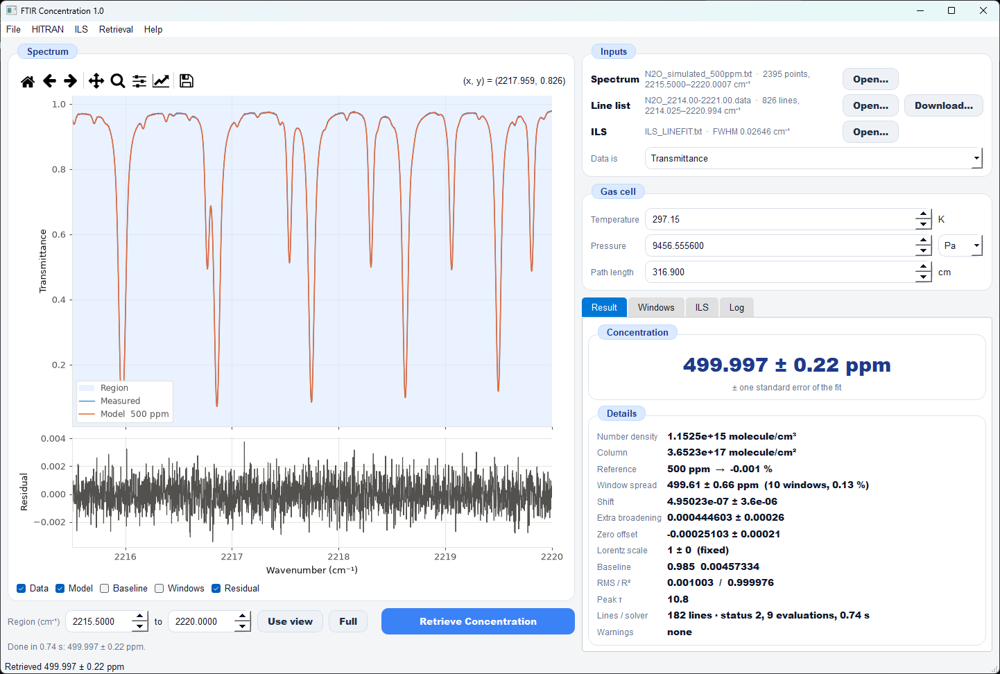

# FTIR Concentration

Retrieves the concentration (mixing ratio, ppm) of a gas from an FTIR
transmittance spectrum. A line-by-line model built from HITRAN and convolved
with the instrument line shape (ILS) is fitted to the measured spectrum, and
the concentration comes out of the fit.

It comes with a desktop GUI (`Concentration_GUI.py`), a headless self-test,
and a script that simulates spectra with a known concentration for testing.

---

## Why fit instead of integrating the absorbance?

The usual shortcut, integrating the absorbance band and dividing by the line
intensity, needs the ILS removed first. Strong lines that are black at their
centre (optical depth τ ≫ 1) lose their core to the instrument, and no
deconvolution can recover it, so the integrated area reads low.

Here the non-linear Beer–Lambert law and the ILS are part of the model, so
saturated lines are handled exactly:

```
τ(ν)       = x · N_total · L · Σ_j S_j(T) · V_j(ν − shift)        (Voigt profiles, HITRAN widths)
T_model(ν) = baseline(ν) · [ (1 − z) · (exp(−τ) ⊛ ILS ⊛ G_w) + z ]
N_total    = P / (k_B · T)
```

| Symbol | Meaning | Fitted? |
|---|---|---|
| `x` | mixing ratio (the answer, reported in ppm) | always |
| `shift` | wavenumber offset, spectrum − HITRAN | optional (default on) |
| `G_w` | extra Gaussian broadening of the ILS (HWHM) | optional (default on) |
| `z` | zero-level offset of the transmittance | optional (default on) |
| Lorentz scale | factor on the HITRAN pressure-broadened widths | optional (default off) |
| `baseline` | polynomial in wavenumber (order 0–6) | always |

As a consistency check, every strong line group is then refitted in its own
window, with shift, broadening and zero held fixed. Weak and saturated lines
should give the same concentration.

---

## Installation

Python 3.9 or newer (tested with 3.14 on Windows).

```bash
python -m venv .venv
.venv\Scripts\activate          # Windows   (Linux/macOS: source .venv/bin/activate)
pip install -r requirements.txt
```

`requirements.txt`: numpy, scipy, matplotlib, PyQt5, hitran-api.

> **Note:** install `PyQt5`, **not** `python-qt5`. That is an old unofficial
> package whose Qt DLLs fail with
> `ImportError: DLL load failed while importing QtWidgets`. If you have it:
> `pip uninstall python-qt5` and then `pip install PyQt5`.

`hitran-api` (HAPI) provides the exact TIPS partition functions, the
isotopologue masses and HITRAN downloads. Without it the program still runs,
with a power-law partition function and no download.

---

## Running

```bash
python Concentration_GUI.py                    # opens the worked example and fits it
python Concentration_GUI.py my_spectrum.txt    # opens your spectrum instead
python Concentration_GUI.py --no-example       # starts empty
python Concentration_GUI.py --selftest         # no window: retrieves the example and prints the result
```

Expected self-test output:

```
example: true 500 ppm   retrieved 499.997 ± 0.22 ppm (-0.001 %)   rms 0.001   10 windows   0.7 s
```

---

## Using the GUI



*The window after the worked example has been fitted: a spectrum simulated at
500 ppm N₂O, retrieved as 499.997 ± 0.22 ppm.*

### The parts of the window

**Menu bar** (top)

| Menu | What it holds |
|---|---|
| **File** | Open Spectrum (Ctrl+O), Save Result (Ctrl+S), Export Curves, Save Plot, Exit |
| **HITRAN** | Open Line List (Ctrl+L), Download Lines from HITRANonline, Add Other Gas from File, Download Other Gas, Clear Other Gases |
| **ILS** | Load ILS File (Ctrl+I), Synthetic ILS (Gaussian or ideal sinc) |
| **Retrieval** | Retrieve Concentration (Ctrl+R), Retrieval Settings (which parameters are fitted, partition function, …) |
| **Help** | Load Example, Load Multi-gas Example, About, Method & Caveats |

**Spectrum** box (left)

| Part | Function |
|---|---|
| Toolbar | Standard matplotlib tools: home (reset view), back/forward, pan, zoom, subplot spacing, axis editor, save. The cursor position (x = wavenumber, y = transmittance) is shown on the right. |
| Upper plot | **Measured** spectrum (blue), fitted **Model** (orange, with its ppm in the legend), and the analysis **Region** (light-blue background). In a good fit the orange line covers the blue line completely, as in the screenshot. |
| Lower plot (**Residual**) | Measured − model. It should look like random noise around zero. Shapes in it (wiggles at the line positions, a slope) point to a wrong ILS, shift, pressure or baseline. |
| Check boxes | Show or hide **Data**, **Model**, **Baseline** (the fitted baseline as a dashed line), **Windows** (dotted lines at the edges of the per-line windows), **Each gas** (in a multi-gas fit, each gas's own modelled transmittance, with its ppm in the legend) and the **Residual** panel. |

**Action row** (below the plot)

| Part | Function |
|---|---|
| **Region (cm⁻¹)** … **to** … | The wavenumber range used in the fit. Only points inside it are fitted. |
| **Use view** | Sets the region to what the plot currently shows. Zoom in with the toolbar, then press it. |
| **Full** | Sets the region to the whole spectrum. |
| **Retrieve Concentration** | Runs the fit (in the background, so the window stays responsive). |
| Status line | What is still missing before a fit can run, or how long the last fit took and its result. |

**Inputs** box (top right)

| Part | Function |
|---|---|
| **Spectrum** · Open… | The measured spectrum: file name, number of points, wavenumber range. |
| **Target gas** · Open… / Download… | The HITRAN lines of the gas to retrieve: its name, file name, number of lines, range. *Download…* fetches a new list from HITRANonline. |
| **Other gases** · Add… / Download… / Clear | Gases whose lines overlap the target's (H2O, CO, CO2 …), one line list each. With any listed, the fit is multi-gas: every gas gets its own concentration. *none* means a single-gas fit. |
| **ILS** · Open… | The instrument line shape and its FWHM (here 0.02646 cm⁻¹). |
| **Data is** | How to read the y values: Transmittance, Absorbance log₁₀(1/T) or Absorbance ln(1/T). It is guessed when a file is opened. |

**Gas cell** box

| Part | Function |
|---|---|
| **Temperature** (K) | Gas temperature. It sets the line intensities S(T), the line widths and N_total. |
| **Pressure** + unit | Total cell pressure (Pa, hPa, mbar, Torr, kPa, atm). Changing the unit converts the number, so the pressure itself stays the same. |
| **Path length** (cm) | Optical path through the gas. For a multipass cell, the total path. |

When a file made by `simulate_spectrum.py` is opened, these three are filled
in from its header automatically.

**Result tabs** (bottom right)

| Tab | Shows |
|---|---|
| **Result** | The concentration and the fitted parameters (explained below). |
| **Windows** | Each strong line group refitted on its own: wavenumber range, ppm ± u, peak τ, RMS, and a plot of all windows against the global result. |
| **ILS** | Plot of the loaded ILS with its FWHM, peak position, centroid, asymmetry and area. |
| **Log** | Time-stamped record of everything loaded, fitted and saved. |

The **status bar** at the very bottom repeats the last result.

### Reading the fit result

Values from the screenshot (the 500 ppm example, true values in brackets):

| Field | Example value | Meaning and what to look for |
|---|---|---|
| **Concentration** | 499.997 ± 0.22 ppm [500] | The mixing ratio x of the gas in ppm (µmol/mol). The ± is one standard error from the fit residuals only. It does **not** include the uncertainty of T, P, L, HITRAN or the ILS (see *Caveats*). |
| **Number density** | 1.1525e+15 molecule/cm³ | x · N_total, with N_total = P / (k_B·T) = 2.305e+18 molecule/cm³ here. |
| **Column** | 3.6523e+17 molecule/cm² | Number density × path length: the number of molecules the beam crosses per cm². |
| **Reference** | 500 ppm → −0.001 % | Only for simulated files: the true ppm from the file header and how far the retrieval is from it. Shows "—" for measured spectra. |
| **Other gases** | none (single-gas fit) | Multi-gas fit only: each other gas's ppm ± u, its deviation from a simulated reference, and its correlation r with the target. \|r\| near 1 means the region cannot separate the two gases. |
| **Window spread** | 499.61 ± 0.66 ppm (10 windows, 0.13 %) | Mean ± standard deviation of the per-window results. Saturated and weak lines should agree. A spread much larger than the ± of the concentration means the model does not describe the lines consistently, usually because of a wrong T, P, ILS or zero level. |
| **Shift** | 4.95e-07 ± 3.6e-06 cm⁻¹ [0] | Wavenumber offset of the spectrum relative to HITRAN. Real spectra are often off by a few 0.01 cm⁻¹. |
| **Extra broadening** | 0.00044 ± 0.00026 cm⁻¹ [0] | Gaussian HWHM added to the ILS. Close to zero means the loaded ILS fits the data. A large value means the real ILS is wider than the loaded one. |
| **Zero offset** | −0.00025 ± 0.00021 [0] · auto: fitted (peak tau 10.8) | Offset z of the transmittance zero level (detector non-linearity, stray light). Mainly matters when lines are saturated. With the default *Auto* setting it is fitted only when the peak τ exceeds 1. |
| **Lorentz scale** | 1 ± 0 (fixed) | Factor on the HITRAN pressure widths. "(fixed)" means it was not fitted (the default). |
| **Baseline** | 0.985  0.00457 | Polynomial coefficients over the region, with the wavenumber scaled to −1…+1. Here: level 0.985 and slope 0.00457 per half-region (2.25 cm⁻¹), i.e. 0.0020 per cm⁻¹ [0.985 and 0.002]. |
| **RMS / R²** | 0.001003 / 0.999976 | RMS of the residual and the coefficient of determination. A good fit has an RMS equal to the noise of the spectrum (0.001 here) and a residual without structure. |
| **Peak τ** | 10.8 | Largest optical depth of the gas, before the instrument smooths it. τ = 10.8 means the line centres transmit e^−10.8 ≈ 0.002 %, so the lines are fully black. The instrument's smoothing makes them appear to reach only about 0.07 in the plot. This is why fitting is used instead of integrating the absorbance. Above τ ≈ 3, the ILS and zero level have a strong influence on the result. |
| **Lines / solver** | 182 lines · status 2, 9 evaluations, 0.74 s | Number of HITRAN lines in the model (lines near the region and stronger than the cut-off), and the `scipy.optimize.least_squares` status: 1–4 = converged (2 = change in residual below tolerance), 0 = stopped at the evaluation limit, −1 = failed. |
| **Warnings** | none | Parameters that ended on a bound (the fit was limited; widen the bound in *Retrieval Settings* or fix the parameter), non-convergence, or saturated lines with the zero offset fixed. |

**Checklist for a trustworthy result:** the residual looks like noise, RMS
≈ the spectrum noise, Warnings says "none", shift and extra broadening are
small, and the window spread is small compared with the concentration.

### Step by step

1. **Spectrum.** Use *File → Open Spectrum* or *Inputs → Open…*. It reads
   two-column text (wavenumber, value; comments with `#`, `%`, `;` are
   skipped) or Bruker OPUS binary files. Check *Data is*.
2. **Line list.** Use *HITRAN → Open Line List* for a 160-character
   HITRAN `.par`/`.data` file, or a CSV with `nu, sw, elower` columns. Or use
   *HITRAN → Download Lines* to fetch one molecule over a wavenumber range
   from HITRANonline into `Input/HITRAN/`. Take the range ~1 cm⁻¹ wider than
   the region, so lines just outside it still contribute their wings.
3. **ILS.** Use *ILS → Load ILS File* for a two-column file (offset from line
   centre in cm⁻¹, value), e.g. `ILS_LINEFIT.txt`. Or use a synthetic
   Gaussian (FWHM) or ideal sinc (maximum OPD).
4. **Gas cell.** Enter the temperature, pressure and path length of the measurement.
5. **Region.** Type the wavenumber limits, or zoom the plot and press *Use view*.
6. **Retrieve Concentration** (Ctrl+R), then read the result as above.

**Several gases.** If other gases absorb in the region, add their line lists
with *Other gases → Add…* (or *Download…*) before step 6. The big number is
still the target gas; the others are listed under *Other gases* in the
Result tab and drawn with *Each gas*. *Help → Load Multi-gas Example* loads
the N2O + H2O + CO simulation from `multigas_example.py` and fits it.

### Saving

* *File → Save Result*: text file with all inputs, fitted parameters and the window table.
* *File → Export Curves*: columns of wavenumber, data, model, baseline, residual (plus each gas's own model in a multi-gas fit).
* *File → Save Plot*: PNG, SVG or PDF at 300 dpi.

Output goes to `Results/` by default. Settings are kept in
`Config/concentration_settings.json`. Both folders are created on first use.

### Retrieval settings (*Retrieval → Retrieval Settings*)

| Setting | Default | Notes |
|---|---|---|
| Fit wavenumber shift, max \|shift\| | on, 0.1 cm⁻¹ | An uncalibrated FTIR axis is often off by a few 0.01 cm⁻¹. |
| Fit extra ILS broadening, start / max | on, 0.003 / 0.05 cm⁻¹ | For an ILS slightly narrower than the one during the measurement. |
| Zero-level offset | Auto | *Auto* fits it only when a line is saturated (peak τ > 1), otherwise keeps it at 0. With thin lines alone it cannot be told apart from the concentration scale. *Fit* / *Fixed at 0* force it. |
| Fit Lorentz width scale | off | Use if the pressure or HITRAN broadening seems off. |
| Baseline polynomial order | 1 | 0 = constant scale. |
| Partition function | TIPS (HAPI) | Or a power law for linear / non-linear molecules. |
| Isotopologues | all | Or the main isotopologue only. |
| Skip lines weaker than | 1e-5 × strongest | Speed. |
| Fine-grid oversampling | 8 | Model points per data point before the ILS convolution. |
| Centre the ILS at | its maximum | Or centroid, or the tabulated zero. |
| Per-window refit | automatic | Or off. Single-gas fits only. |

---

## Worked example (in `Input/`)

| File | Content |
|---|---|
| `N2O_simulated_500ppm.txt` | Spectrum simulated at **500 ppm N₂O**, 297.15 K, 9456.56 Pa, 316.9 cm, noise 0.001. The values are in its header, and the GUI fills in the gas cell from them and reports the deviation from 500 ppm. |
| `MP_spectrum_2.txt` | Measured multipass-cell N₂O spectrum, 2215–2228 cm⁻¹. |
| `HITRAN/N2O_2214.00-2221.00.data` (+ `.header`) | HITRAN N₂O lines, 2214–2221 cm⁻¹. |
| `Mix_N2O_H2O_CO_simulated.txt` | Multi-gas example: 500 ppm N₂O, 20000 ppm H₂O and 30 ppm CO, 2160–2163.5 cm⁻¹ (same cell and noise). |
| `HITRAN/{N2O,H2O,CO}_2156.00-2168.00.data` (+ `.header`) | Line lists for the multi-gas example. |
| `ILS_LINEFIT.txt` | Measured ILS from LINEFIT. |
| `ilsparms.dat` | LINEFIT modulation efficiency and phase vs OPD (`ils.ils_from_linefit_params` turns it into an ILS). |

At start-up the GUI loads the simulated spectrum, the line list and the ILS,
sets the region to 2215.5–2220 cm⁻¹ and fits. The answer should be 500 ppm
within about ±0.2 ppm.

---

## Simulating test spectra

`simulate_spectrum.py` computes a spectrum with HAPI's own line-by-line code,
independently of `retrieval.py`, so it is a fair test of the retrieval:

```bash
python simulate_spectrum.py                                  # the 500 ppm N2O example
python simulate_spectrum.py --ppm 320 --noise 5e-4 --out Input/N2O_320ppm.txt
python simulate_spectrum.py --help                           # T, P, L, range, step, baseline, seed …
```

The header of the output file records every input, including the true ppm.
For a mixture, give each gas with `--gas LINES PPM` (repeatable); the
optical depths add.

---

## Several gases at once (multi-gas fit)

`fit_spectrum` gives every line in its line list the same mixing ratio, so it
retrieves one gas. When other absorbers overlap the target's lines, use
`retrieval.fit_multigas`, which fits one mixing ratio per gas. The shift,
ILS broadening, zero level, Lorentz scale and baseline are shared:

```
τ(ν) = Σ_k x_k · N_total · L · Σ_j S_kj(T) · V_kj(ν − shift)
```

```python
r = rt.fit_multigas(x, y, [("N2O", n2o_lines), ("H2O", h2o_lines), ("CO", co_lines)],
                    T=297.15, P_pa=9456.56, L_cm=316.9, ils=ils, options={"fit_zero": False})
print(r["ppm"], r["ppm_err"], r["corr"])      # dicts by gas name; correlation of the x_k
```

It also returns each gas's own transmittance (`r["components"]`). It refits
once with each gas self-broadened at its fitted mixing ratio, which matters
for H2O at the per-cent level.

`multigas_example.py` downloads N2O, H2O and CO lines, simulates a mixture
(500 ppm N2O, 2 % H2O, 30 ppm CO) in 2160.0–2163.5 cm⁻¹ and retrieves it. In
that window the H2O line at 2161.73 cm⁻¹ sits between two N2O lines and next to
CO R(4). Over 20 noise realisations (`--mc 20`), the mean bias ± standard
deviation was:

| Fit | N2O | H2O | CO |
|---|---|---|---|
| N2O + H2O + CO | +0.06 ± 0.31 % | −0.23 ± 0.58 % | +0.07 ± 0.21 % |
| N2O + CO (H2O ignored) | −1.35 ± 0.33 % | – | −0.38 ± 0.22 % |
| N2O only | −0.68 ± 0.43 % | – | – |

Leaving H2O out biases N2O low because the fit absorbs the H2O line into the
baseline and the neighbouring N2O lines. The single-gas fit leaves residuals
of up to 0.17 in transmittance.

**Zero level with weak lines:** when every line is optically thin,
`(1 − z)·e^(−τ) + z ≈ 1 − (1 − z)·τ`, so the zero offset and a common scale
on all the mixing ratios cannot be told apart. With the zero offset left free
in this window, it ran to −0.23 and every gas came out about 20 % low. Fit
`z` only when at least one line is saturated (peak τ well above 1).
`options={"fit_zero": "auto"}` does this in both fit functions: it fits with
`z = 0`, then refits with `z` free only if the peak τ is above 1. *Auto* is
also the GUI's default.

---

## Files

| File | Purpose |
|---|---|
| `Concentration_GUI.py` | The window: inputs, plots, result tabs, saving. Also `--selftest`. |
| `gui_common.py` | Shared by all GUIs in this folder (this one and future ones): stylesheet, colours, plot canvas, table styling, background worker thread, Config/Results folders and JSON settings helpers. Each GUI keeps its own settings in its own file. |
| `retrieval.py` | The forward model and the fits (`fit_spectrum`, multi-gas `fit_multigas`), automatic line windows. |
| `concentration.py` | HITRAN line-list reader, line intensity at T, partition-function ratio, number density, integrated-area concentration with uncertainty budget. |
| `hitran_fetch.py` | HAPI wrapper: download lines, TIPS partition sums, isotopologue masses. |
| `ils.py` | ILS kernel sampling and centring, convolution, synthetic and LINEFIT ILS, ILS statistics. |
| `spectrum_io.py` | Reads text and Bruker OPUS spectra and ILS files; absorbance ↔ transmittance. |
| `simulate_spectrum.py` | Simulated spectra with a known concentration (one gas or a mixture). |
| `multigas_example.py` | Simulated N2O + H2O + CO spectrum retrieved with the multi-gas fit, compared with single-gas fits. |
| `requirements.txt` | Python dependencies. |

### Using the retrieval from your own script

```python
import spectrum_io as sio, concentration as conc, retrieval as rt

sp    = sio.load_spectrum("Input/MP_spectrum_2.txt")
lines = conc.load_hitran("Input/HITRAN/N2O_2214.00-2221.00.data")
ils   = sio.load_ils("Input/ILS_LINEFIT.txt")
m     = (sp.x >= 2215.5) & (sp.x <= 2220.0)

r = rt.fit_spectrum(sp.x[m], sp.y[m], lines, T=297.15, P_pa=9456.56, L_cm=316.9, ils=ils,
                    options={"windows": "auto"})
print(r["ppm"], r["ppm_err"], [w["ppm"] for w in r["windows"]])
```

---

## Caveats

* **The ± is the fit noise only.** It does not include the uncertainty of
  temperature, pressure, path length, HITRAN intensities or the ILS. The
  concentration scales as 1/(N_total·L), so a 1 % error in P or L is a 1 %
  error in ppm. The spread of the per-window results is a better guide to
  model error.
* **Saturated lines** (peak τ ≫ 1) make the result sensitive to the ILS
  shape and the zero level. Keep the zero offset free, and compare the weak-
  and strong-line windows.
* **Parameters on a bound** (listed under Warnings) mean the fit traded them
  against something else. Widen the bound or fix the parameter.
* HITRAN intensities include natural isotopic abundance. With all
  isotopologues in the line list, the result is the total mixing ratio of the
  molecule.
* The spectrum should be on a (nearly) uniform wavenumber grid, with spacing
  well below the ILS width.
